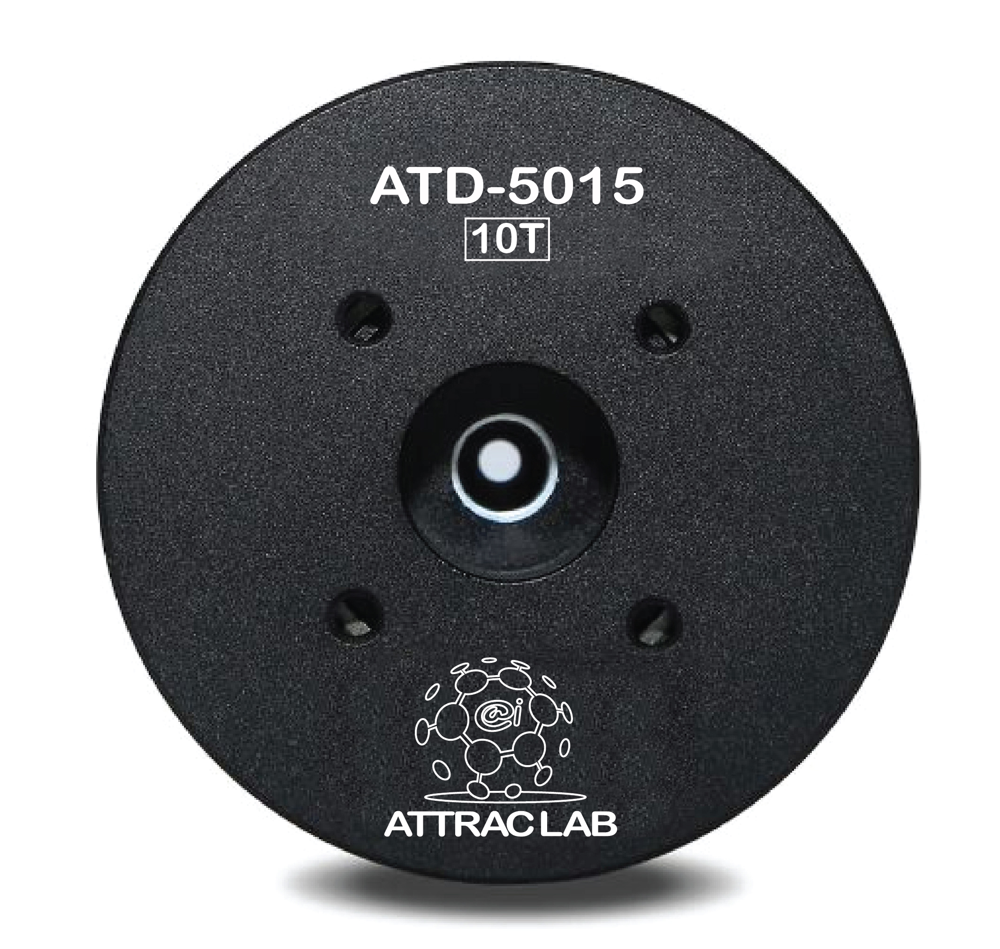

# ATServo

This is an official API for ATD servo as shown in figure below.

The servo uses RS485 communication for send/receive packet from user computer. You may need to have USB to RS485 module to connect a servo to your computer.

This API was developed on Jetson Nano, linux os.

You can find an example on main.cpp

To run this, type `make` on the terminal of this directory. Then type `./testServo`.

There are 6 control modes you can play with...
1. TorqueControl: The motor will spin around with its full speed to detect a torque attached on.
2. SpeedControl: Control the servo speed
3. PositionControlMode1: control the position of servo with full speed turning. It can be multi-turn.
4. PositionControlMode2: control both speed and position, it can be multi-turn.
5. PositionControlMode3: control position with the direction with full speed, this is only for 0-360deg.
6. PositionControlMode4: control speed, position and direction, this is only for 0-360deg.

There is also a feedback of encoder, by calling `GetCurrentDeg()`.

And some additional function like, `MotorStop`, `MotorRun`, `MotorOff` and etc. Please check more detail of each function in ATServoClass.h
